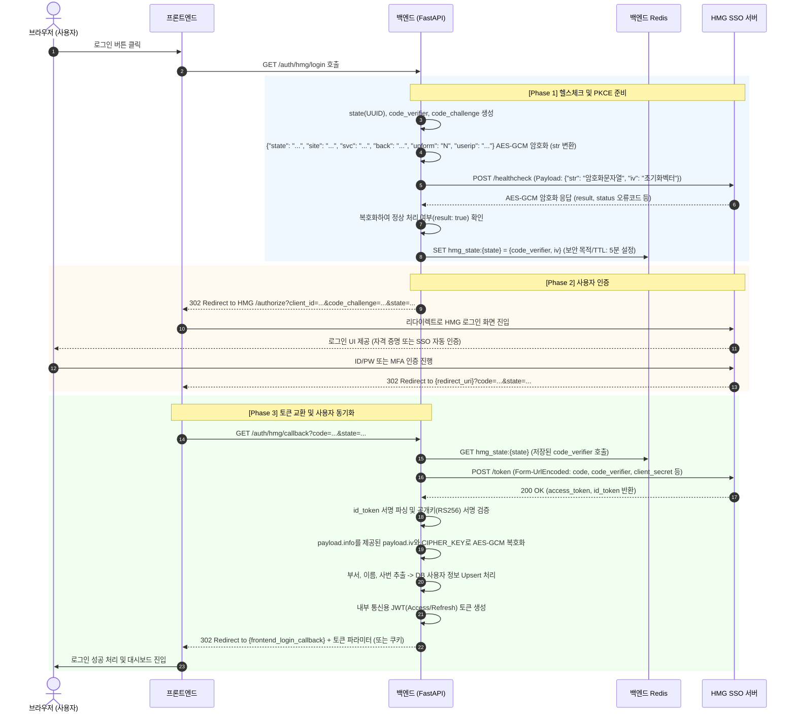

# HMG SSO 상세 마이그레이션 및 구현 계획서

## 1. 아키텍처 개요 및 인증 흐름 (Sequence Diagram)

HMG SSO의 인증 흐름은 일반 로컬 로그인보다 복잡하며, 서버 간 백그라운드 통신(Healthcheck)과 PKCE 보안 규격, 그리고 브라우저 리다이렉션이 정교하게 결합되어 있습니다.

![HMG SSO Sequence Diagram](https://mermaid.ink/img/pako:eNqFVu9v4jgQ_VcsPpxAB8UJMSRI21V_QLfX6xWVotXpWCHHdkq0kHSTUN0d4n-_mYnpEgg6PoRgPOPxm_eevW2oVJvGkDVy82NjEmVuY_mayfU8YfCRmyJNNuvQZPa3KtKMzXKTMZmz-SY0XMFzMICn6occnj7nrAnfXNKYDOA5CHirTPAmsyJW8ZtMCjYelUm04B4k8fsQrt3QhwChccTT6jTq2kaFqucczmTNscyLq8l9zUrPRsf5mTD67zRkOn3CgC-Pd_QKIY6DW1W-N0_K6QhD5_JyPBpiXl_A31JHWP5g4DM7F3ekcJN8gCsGUpfB4xGEXkPo3eiFdQHnZXe5fu2u0tc4wen9HibSgUWgfGZGFSx7DZuux9vM9Xx4CGE3_EdaGJa-Q2uuR20sesj-mixlbpjzjVA22BBXQhlKhVgZ7ysqk0ds8nAzwk0GnGNXPa_Meb2vMi9kYZqz2f1tq82QMgtYKI5ik9mfailXK5O8GszCtUbAAOlqlu28QYnmQLh54-LiYt5ow0senw69q6ORUKrvB0M7djWadu5uHnE9Ibw9ZLovDmsnGCZPU8B4aeSqWKqlUd-JoMdBQAeH8AgJeuAsToo81mGF-bvovq1knFisIW3H7ul8GTg0EMC20I0Ea7qcY9Mc0AeuFTmElHKwERpbEwnLydYRbNijSFSL1UKQUIyqpGkivpt8iIsRjYQo-XiYkyg_ZFNgHnBuQS0Zbulrxz6xbaW_O9Z8efl9yCBPqH3alOMih3xnzzyT6HqWCoEEJary_2Wp-42d2gYrq0dmBvpjC1Z1Pe6SfGnBIiWxkpTSLP7XfFar2CTFItafgDG_VFlKQ7RjfDuQJFVEQkW1u8ajAsifeLD3JxQ7rVare8smOSCwAkUpfFFhDnpHrW3M7hlhi6MKabOnolQyYBYHSO4LjO47KFc38PYmRVPDng4qwLUqhkVbvL_tTr5WUzyOrypRH9Vr4QeV6uvA32b2x2KTxbvPCHcdyMSVWjcjstTwZAw8QRVYmvTIzBzJyVORIBIOEELd37tZLY8QFZhsevzQJc74sAKeoOOc3cehkO5qhdQsD0NcXwrrLhVlVWy-VW9aRfrdJHC0pdm6M8tWowQz6CElOjXikvC5UZkprMmcGhZYA3t6YE2plMnzBa3QZrEu3whCp7SZvWkc2dHBVHsolmzUPU4nDDmb7YMk45IKp2kuvebz1BX91nGoBKSONF6u9Sb_WaVSX8RJlKIqB6oiDwvrx6x37LnH2c395MvoefEw-tOK9adLn1jpiddqqgXKa7MP8Qe-1_6gFRzsSDVom1c2j3Uu2e31GfsCn6RVPTZ7AwFiY5QKfOsxJ6tzPJqxBqJ5iPbtGl4mZb99fWleUd-6zybKTL5sHauh5vA9p9goS5MCBLmgW8diz_kd-_U4adna8p4XhmhW2unRPe_AP_AIM7zsc-tAXWe9zpZZGt0hKj_5E_ZIQa5WJYb20nbqq7ANuCY01iZby1jDPWHbKJZmTVdbbSK5WRWN3e4_DYVY1A==)

## 2. 보안 요구사항 및 암호화 구현 방안 (AES-GCM & RSA)

이번 구축에서 기술적 챌린지는 데이터 통신 구간을 모두 암복호화하는 부분입니다. `cryptography` 라이브러리를 활용한 전담 암복호화 모듈을 `app/utils/sso_crypto.py`에 생성해야 합니다.

### 2.1 AES-GCM (Galois/Counter Mode) 구현 체계
* **용도**: `/healthcheck` Payload 양방향 암호화, `/token` 응답 내 `info` 데이터 복호화.
* **주요 구성요소**:
  - `Key` (Cipher Key): `.env`의 `HMG_SSO_CIPHER_KEY` (통상 256bit 사이즈).
  - `IV` (초기화 벡터): 
    - 암호화(Healthcheck 요청) 시: 백엔드에서 `os.urandom(12)` 등으로 12바이트 랜덤 생성 후 Payload와 병합하여 전송.
    - 복호화(Payload info 파싱) 시: 제공받은 `ID_TOKEN` payload 상의 `iv` 필드를 획득하여 복호화에 사용.
* **태그(Auth Tag) 로직**:
  - GCM 모드는 무결성 검증을 위해 16바이트 크기의 Tag를 생성합니다. HMG 정책상 이 태그 위치(데이터의 맨 앞 혹은 뒤)를 파악하여 `cryptography.hazmat` 알고리즘에 올바르게 반영하는 코드를 작성해야 합니다.

### 2.2 ID 토큰 서명 검증 (RS256)
* HMG SSO가 준 `id_token`은 JWT 형태입니다. 조작 여부를 확인하기 위해 Header에 명시된 `kid`(Publickey id)와 `alg`를 바탕으로 서명을 검증해야 합니다. 이는 PyJWT를 이용해 `jwt.decode` API를 호출하고 옵션으로 `algorithms=["RS256"]`을 지정하며, 올바른 공개키(SSO 포탈의 JWKS 엔드포인트나 사전에 교부받은 키 배열에서 로드)를 제공해야 합니다.

---

## 3. 코드 단위 상세 개발 계획

기존 로그인 시스템을 갈아엎고 아래의 4가지 파트로 나누어 코드를 릴리즈할 예정입니다.

### [Part 1] 환경변수 등록 및 모델 테이블 마이그레이션
1. **대상 파일:** `app/core/config.py`, `app/models/user.py`, `app/schemas/user.py`
2. **진행 내용:**
   - 기존의 비밀번호 기반 로컬 인증 시스템 관련 코드와 DB 필드(`hashed_password`)는 **완전히 제거**합니다. (모든 인증을 HMG SSO로 통일)
   - DB 테이블상 사용자 매핑 플랜 (HMG Payload 기준):
     * ID_TOKEN의 `sub` ➡ `social_id` (고유값)
     * info 내 `userid` ➡ `employee_id` (명확한 사번/메인 식별자 필드로 개편)
     * 추가 추적 필드 ➡ `last_login_at` (최종 접속 일시, 매 로그인 성공시 갱신)
     * info 내 `site`, `sitename` ➡ `site_code`, `site_name`
     * info 내 `userinfo.displayName` ➡ `full_name`
     * info 내 `userinfo.mail` ➡ `email`
     * info 내 `userinfo.UPN` ➡ `upn`
     * info 내 `userinfo.objectGUID` ➡ `object_guid`
     * info 내 `userinfo.department`, `departmentCode` ➡ `department`, `department_code`
   - **권한 체계(Role Enum) 및 부서(UserGroup) 모델 개편**:
     * 사내 규칙에 대응하여 5단계 권한 등급을 확립합니다: `SUPERADMIN`, `ADMIN`, `USER`, `PERMISSION_REQUESTED`, `PERMISSION_REQUIRED`.
     * 부서 정보를 관할하는 모델(`UserGroup`)에 `whitelisted` (Boolean) 속성을 추가하여 화이트리스트 접근 제어 뼈대를 마련합니다.
   - `app/core/config.py`에 다음 필수 HMG SSO 환경 변수 명세 추가 확정:
     * `HMG_SSO_BASE_URL`: 인증 엔드포인트 도메인
     * `HMG_SSO_CLIENT_ID`: 서비스 코드 (svc, client_id)
     * `HMG_SSO_CLIENT_SECRET`: 토큰 교환을 위한 서비스 패스워드
     * `HMG_SSO_CIPHER_KEY`: AES-GCM 암복호화를 위한 사전 공유키(또는 솔트)
     * `HMG_SSO_CALLBACK_URI`: HMG -> 우리 서버로 돌아올 백엔드 콜백 URL
     * `HMG_SSO_POST_LOGOUT_REDIRECT_URI`: 완전 로그아웃 후 보내질 페이지
     * `HMG_SSO_FRONTEND_LOGIN_CALLBACK_URL`: 백엔드 -> 프론트 서버로 자체 토큰을 내려줄 엔드포인트
     * `LOGIN_SESSION_TIMEOUT_MINUTES`: 내부 세션 갱신/만료 기준

### [Part 2] 보안 암호화 유틸리티 개발
1. **대상 파일:** 신설 `app/utils/sso_crypto.py`
2. **진행 내용:**
   - `HmgCrypto` 전담 클래스를 작성하여 `AESGCM` 복호화 객체 초기화.
   - `encrypt_payload(payload: dict) -> tuple[str, str]`: payload JSON 파싱 -> 12바이트 IV 무작위 생성 -> GCM 암호화 진행 -> 결과값으로 `(암호화된 문자열, 생성된 IV)`를 튜플 형태로 동시 반환.
   - `decrypt_payload(encoded_str: str, iv: str) -> dict`: 복호화 대상 암호문과 **암호화 시 직접 생성했던(혹은 ID_TOKEN에서 전달받은) 동일한 IV**를 주입받아 복호화 처리 후 JSON Dict를 반환 (Healthcheck 응답 복호화 및 유저 info 공용 설계).

### [Part 2-1] HMG 맞춤형 에러 핸들링 모듈 개발 (신설)
1. **대상 파일:** 신설 `app/utils/hmg_error_handler.py`
2. **진행 내용:**
   - 인사 시스템 기반의 상세 인가 거부상태(`RETIRED(퇴직)`, `SUSPENDED(정직)`, `REST(휴직)`) 사유나 Healthcheck의 8개 오류 코드(`2000`~`5000`)를 일관성 있는 커스텀 FastAPI Exception 구조로 변환하는 전담 로직.
   - 단순히 `HTTP 403 / 500`를 던지고 마는 파편화된 응답이 아닌, 프론트엔드가 즉각적으로 로그인 UI 모달/알림 팝업에 노출하기 편리한 정제된 `{ "error_code": "...", "message": "..." }` 포맷의 JSON으로 통일합니다.

### [Part 3] HMG OIDC Provider 엔진 조립
1. **대상 파일:** 신설 `app/services/oidc/hmg_provider.py` (BaseOIDCProvider 상속)
2. **진행 내용:**
   - **(핵심 통신)** 모든 HMG SSO 외부 API 연동은 `httpx.AsyncClient()`를 활용한 100% 비동기 I/O 방식으로 처리되어, FastAPI 내부 이벤트 쓰레드의 블로킹(Blocking)을 완벽히 차단합니다.
   - `ping_healthcheck()` 로직 구현: `encrypt_payload`로 생성된 `iv`를 컨텍스트 메모리에 유지시킨 상태로 비동기 POST 전송합니다. 이후 HMG 응답 수신 시, 갖고 있던 **동일한 `iv`를 `decrypt_payload`에 주입**해 결과를 복호화합니다. `result: true` 여부를 판단 기준으로 삼으며, `false`일 경우 내포된 `status` 에러 코드를 파싱해 차단합니다.
   - `get_login_url()` 로직 구현: PKCE 요건 충족(code_challenge_method=S256 활용), `site`, `svc` 등 사전 탑재된 URL 구성.
   - `get_token_from_code()` 및 `get_user_info()` 로직 구현: Token 교환 API 역시 비동기로 처리됩니다. ID_TOKEN 수신 시 `RS256` 서명 무결성 확인은 물론, OIDC 표준 클레임 자동 검증(`exp`, `iss`, `aud`, `nonce` 등)을 거칩니다. 관문 통과 후 최종적으로 `AES-GCM`을 통해 `OIDCUserInfo` 파싱을 완료합니다.

### [Part 4] 통합 사용자 처리 라우터 리팩토링
1. **대상 파일:** `app/api/v1/endpoints/auth.py`, `app/services/auth.py`
2. **진행 내용:**
   - 기존의 비밀번호 기반의 로컬 라우터(`/register`, `/login`)는 파기합니다.
   - **`GET /auth/{provider}/login` (provider='hmg')** : PKCE 용 `state`, `code_verifier`, 공격 방어용 임의 `nonce` 및 AES-GCM용 `iv` 등 OIDC 표준 및 HMG 스펙 동시 생성 -> Healthcheck 데이터 전송. 정상 판정 시 Redis에 `state`를 키로 구조체 `{code_verifier, iv, nonce}` 일괄 저장(TTL 300초 지정). 이후 HMG 서버 `/authorize` 리다이렉트 (nonce 탑재).
   - **`GET /auth/{provider}/callback` (provider='hmg')** : 
     - GET 쿼리로 넘겨받은 `code` 및 `state` 확보. Redis 단에 `state` 조회하여 저장된 `code_verifier` 및 보관해둔 `iv`, `nonce` 추출 (무단 접근 시 에러 반환).
     - HmgProvider를 거쳐 토큰 교환. 획득한 ID_TOKEN 내부의 반환된 `iv` 값과, 우리가 Redis에 보관해둔 초기 `iv` 값이 일치하는지 비교하여 서명 무결성을 이중 교차 검증합니다.
     - `auth_service.sync_hmg_user()`를 호출하여 사번(`employee_id`)을 바탕으로 유저 정보를 등록 또는 병합합니다. **이때 유저의 소속 부서가 DB의 `UserGroup.whitelisted == True` 이면 `Role.USER` 권한을 즉석에서 부여하며, False이거나 시스템 상 식별되지 않는 일반 부서인 경우 `Role.PERMISSION_REQUIRED`로 강제 고정하여 관리자 승인 대기 상태**를 유도합니다.
     - 로그인 동기화 완전 성공 직전, 사용자의 `last_login_at` 접속 시간 필드를 현재 시각으로 갱신합니다. 이후 생성된 자체 Access/Refresh 토큰 및 HMG 원본 `id_token`을 **보안이 강화된 `HttpOnly` 쿠키에 심어서 프론트엔드로 응답(Redirect)** 합니다.
   - **`GET /auth/status` (세션 상태 검증 API 추가)** : 프론트엔드의 세션 유지 점검 요청 시, 브라우저가 자동 송출한 `HttpOnly` 쿠키 내의 `id_token`을 추출합니다. 서명 및 `exp`(만료기한)를 검증하고, 유효한 경우 현재 내부 API의 사용자 등급(Role/승인 여부) 상태를 즉각 반환합니다.
   - **`GET /auth/logout`** : 백엔드로 들어온 로그아웃 요청 시, 우선 쿠키에서 꺼낸 `id_token` 값을 메모리에 백업하고 브라우저상의 쿠키를 파기 및 자체 인증 세션을 해지시킵니다. 직후 확보해둔 `id_token`을 `id_token_hint` 쿼리로 포장해 사용자 브라우저를 HMG의 `/logout` 엔드포인트로 이동(리다이렉트)시킵니다.

---

## 4. 예외 리포팅 (Error Handling) 대응 전략
가이드 상 정의된 모든 SSO 응답/에러 코드는 신설될 `app/utils/hmg_error_handler.py`를 경유해 중앙 통제기로 가로채어, 아래의 규격에 맞는 직관적인 안내 메시지로 래핑(Wrapping) 후 프론트엔드로 전송합니다.

### 4.1 Healthcheck 엔드포인트 에러 (POST /healthcheck)
* **Connect Timeout (서버 다운)**: HMG SSO 서버 타임아웃 발생 시 Exception을 반환하여, 프론트엔드가 **"SSO 인증 서버에 연결할 수 없습니다. 잠시 후 다시 시도해주세요"** 라는 장애 안내 페이지를 노출하도록 처리합니다. (로컬 우회 로그인 지원 안함)
* **응답 복호화 후 `result: false`일 경우의 상태 코드(status)별 조치 사항**:
  - `status: 2000` (body 파라미터 없음) -> 백엔드 전송 파라미터(JSON Body) 점검 후 자체 재시도.
  - `status: 2100` (필수 파라미터 1개이상 없음) -> 백엔드 암호화 및 파라미터 빌드 점검 후 자체 재시도.
  - `status: 3000` (등록되지 않은 회사) -> "HMG SSO 관리자에게 문의" 안내 (HTTP 500)
  - `status: 3100` (등록되지 않은 서비스) -> "HMG SSO 관리자에게 문의" 안내 (HTTP 500)
  - `status: 3200` (등록되지 않은 redirect_uri) -> "HMG SSO 관리자에게 문의" 안내 (HTTP 500)
  - `status: 3300` (서비스에 연동되지 않은 회사) -> "HMG SSO 관리자에게 문의" 안내 (HTTP 500)
  - `status: 4000` (사용된 state) -> 세션 난수 중복 오류. 신규 state 발급 후 재시도를 위해 브라우저 새로고침 유도.
  - `status: 5000` (알 수 없는 오류) -> "HMG SSO 관리자에게 문의" 안내 (HTTP 500)

### 4.2 Authorize (인가 콜백) 에러 (GET /callback)
* `error_description="HEALTHCHECK NOT DONE"`: "네트워크 일시 오류" 안내 후 사용자에게 헬스체크 로그인 초기화면부터 재시도 안내.
* `error_description="BLOCKED"`: 권한 없는 사용자 (HTTP 403 Forbidden 후 로그인 페이지 반환)
* `error_description="RETIRED"`: 퇴직자 (HTTP 403 Forbidden 후 로그인 페이지 반환)
* `error_description="SUSPENDED"`: 정직자 (HTTP 403 Forbidden 후 로그인 페이지 반환)
* `error_description="REST"`: 휴직자 (HTTP 403 Forbidden 후 로그인 페이지 반환)
* `error_description="EXPIRED"`: 비밀번호 만료 (HMG SSO 비밀번호 변경 페이지로 우회 안내)

### 4.3 토큰 획득 에러 (POST /token)
* `HTTP 400`: 요청 오류 (code 재사용 등 파라미터 오류). 재로그인 세션 생성 유도.
* `HTTP 401`: 권한 오류 (client_secret 불일치 등 시스템 연동 오류). 관리자 확인용 HTTP 500 처리.

### 4.4 통합 로그아웃 및 세션 무결성 검증 (HttpOnly 쿠키 활용)
- HMG SSO 완전 로그아웃(`/logout`)을 호출하기 위해선, 로그인 시 반환받은 HMG 원본 발급 `id_token`이 `id_token_hint` 매개변수로 반드시 필요합니다.
- **전략 (HttpOnly Cookie 도입):** 기존처럼 Redis에 매핑하여 단일장애점 복잡성을 높이는 대신, 콜백 시 발급된 `id_token`을 프론트엔드로 가는 **브라우저 `HttpOnly`(XSS방어) 및 `Secure` 쿠키에 곧바로 심어 관리**합니다.
- 로그아웃(`/auth/logout`)이나 상태 체크(`/auth/status`) 등 서버단 검증이 필요한 API마다 브라우저가 해당 쿠키를 100% 자동 동봉해 주어 별도의 세션 결속 관리(Session-binding) 로직 없이 매우 안전하고 직관적인 유지보수가 가능해집니다.

---

## 5. 단계별 온보딩 및 부서 화이트리스트 승인 정책 (RBAC)

사내 인가 규정에 따라 부여되는 5단계 권한(`SUPERADMIN`, `ADMIN`, `USER`, `PERMISSION_REQUESTED`, `PERMISSION_REQUIRED`) 체제를 통해 아래와 같은 비즈니스 흐름이 적용됩니다.

* **초기 진입 장벽 (SSO Login & Role Assign)**
  * 사용자의 최초 SSO 진입 동기화 시, 소속된 부서가 `UserGroup`상 **화이트리스트 부서**로 설정되어 있다면 즉시 권한을 `USER` 로 승격시켜 서비스를 개시하도록 허용합니다.
  * **일반 미확인 부서**의 경우 계정 자체는 DB에 동기화 생성되지만, 상태가 `PERMISSION_REQUIRED` 락(Lock)에 걸려 있어 접근이 제한됩니다.

* **관리자의 초기 승인 해제 (Onboarding)**
  * `ADMIN` 권한을 가진 담당자가 관리 시스템을 통해 Lock이 걸린 `PERMISSION_REQUIRED` 단계에 있는 인원들의 부서나 사번을 검토 후, 수동으로 승인해 `USER` 상태로 구원(변경)해주어야만 온보딩이 완료됩니다.

* **권고 직무 배정 (SuperAdmin)**
  * `SUPERADMIN`은 서비스의 최상위 권한자로, 다른 일반 유저들을 `ADMIN`으로 임명해 중간 관리 역할을 배분하거나 통제할 수 있습니다.
