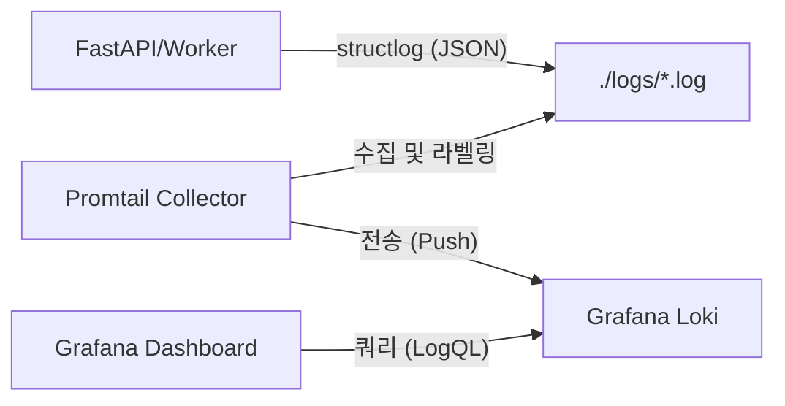

# 통합 로깅 아키텍처 구축 계획서

이 문서는 **structlog**, **Promtail**, **Grafana Loki**, 그리고 **Grafana**를 통합하여 중앙 집중식 구조화 로깅 시스템을 구축하기 위한 상세 계획을 담고 있습니다.

## 1. 아키텍처 개요
전체 시스템은 "PLG" (Promtail, Loki, Grafana) 스택을 기반으로 하며, 애플리케이션 로그를 구조화된 JSON 데이터로 처리하여 강력한 검색 및 시각화 기능을 제공합니다.

---

## 2. 1단계: 애플리케이션 로깅 최적화 (structlog)
현재 보일러플레이트의 `app/utils/logging.py` 설정을 Loki 통합에 최적화된 형태로 미세 조정합니다.

### 주요 작업 내용:
- **필드 표준화**: Loki에서 기본적으로 인식하기 쉬운 `timestamp`, `level`, `logger`, `event` 등의 루트 필드를 고정합니다.
- **컨텍스트 바인딩(Context Binding) 강화**: 
  - `RequestIDMiddleware`를 통해 모든 HTTP 요청에 `request_id` 부여.
  - 로그인된 사용자의 경우 `user_id`, `org_id` 등을 로그 컨텍스트에 자동 주입.
- **로그 로테이션**: 디스크 공간 관리를 위해 현재의 `TimedRotatingFileHandler` 설정을 유지합니다.

---

## 3. 2단계: 로그 수집기 설정 (Promtail)
Promtail은 호스트나 볼륨에 기록된 로그 파일을 감시하고, 메타데이터(라벨)를 붙여 Loki로 보내는 역할을 합니다.

### 주요 작업 내용:
- **설정 파일 생성**: `docker/logging/promtail-config.yml` 작성.
- **동적 라벨링**:
  - `job="fastapi-app"`
  - `env="development|production"`
  - `service="api|worker"` (서비스별 구분)
- **파이프라인 구성**: 전송 전 민감 정보를 마스킹하거나, 특정 로그 레벨에 따른 필터링 단계를 구성합니다.

---

## 4. 3단계: 로그 저장소 설정 (Grafana Loki)
Loki는 인덱스 사용량을 최소화하면서 대량의 로그를 효율적으로 저장합니다.

### 주요 작업 내용:
- **설정 파일 생성**: `docker/logging/loki-config.yml` 작성.
- **데이터 보관 정책 (Retention)**: `retention_period: 30d` 등 실무 환경에 맞는 보관 주기 설정.
- **저장소 최적화**: 로컬 테스트 환경에서는 `filesystem`을 사용합니다.

---

## 5. 4단계: 시각화 및 대시보드 (Grafana)
Grafana를 통해 로그를 검색하고 시스템 상태를 모니터링합니다.

### 주요 작업 내용:
- **데이터 소스 자동화**: `docker/logging/grafana-datasources.yml`을 통해 실행 시 Loki가 자동으로 연결되도록 설정.
- **통합 대시보드 구축**:
  - **로그 탐색기**: `request_id` 기반의 전체 흐름(Trace) 추적.
  - **에러 모니터링**: 5xx 에러 실시간 카운트 및 알림 설정.

---

## 6. 인프라 통합 (Docker Compose)
개발 환경에서 즉시 테스트할 수 있도록 다음 서비스들을 `docker-compose.yml`에 추가합니다 (Loki, Promtail, Grafana).

---

## 7. 향후 확장 (Kubernetes)
프로덕션 환경(K8s) 배포 시에는 Helm Chart를 사용하여 클러스터 전체의 로그 수집 시스템으로 확장할 계획입니다.
