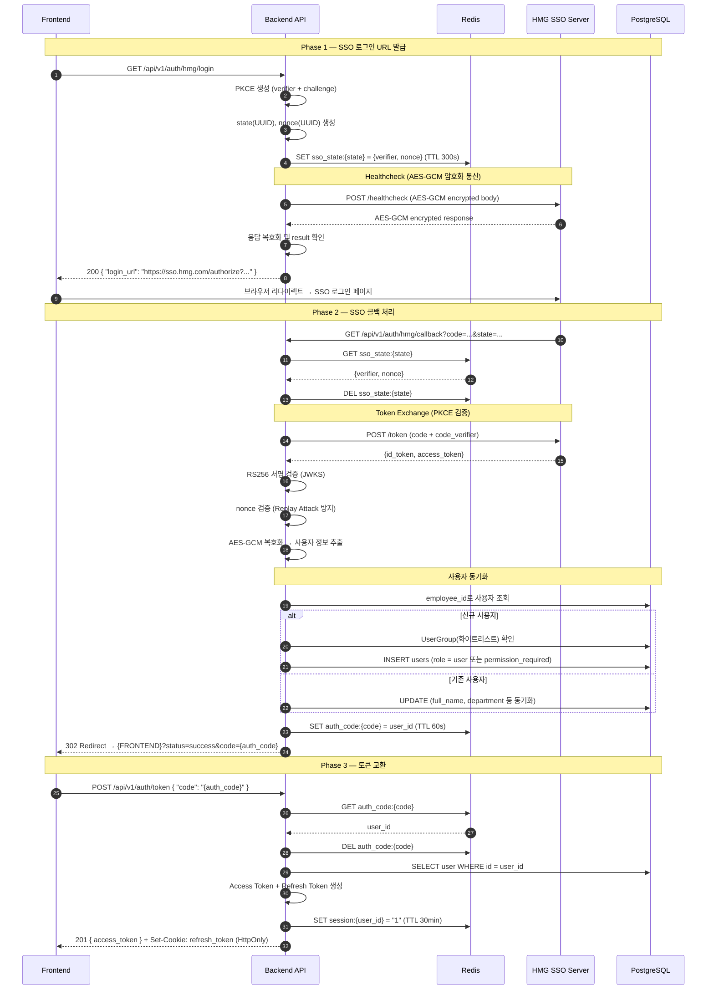
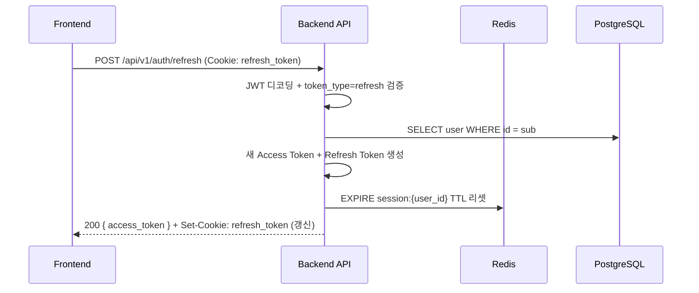
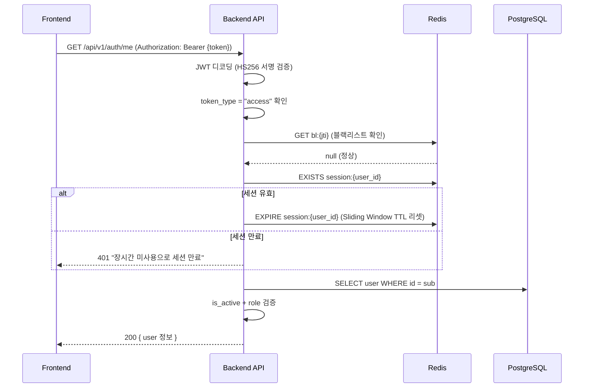
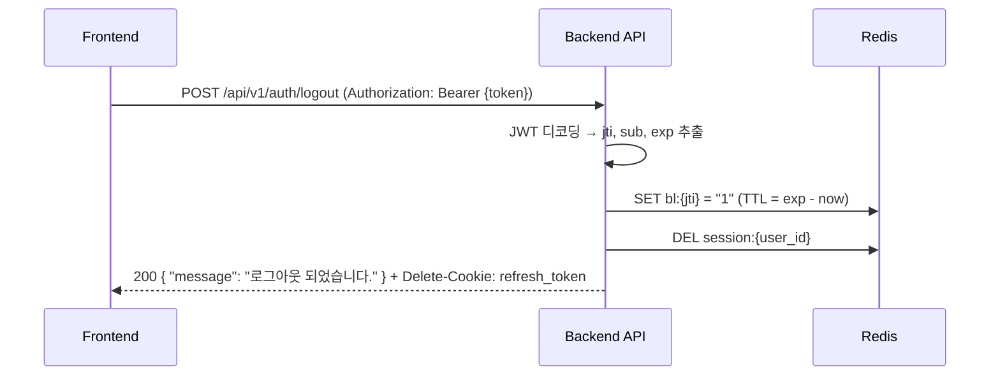

# 🔐 로그인 시스템 아키텍처 문서

> **프로젝트**: FastAPI Boilerplate (HMG SSO 연동)
> **최종 갱신**: 2026-04-30

---

## 1. 아키텍처 개요

HMG(현대자동차그룹) SSO 기반 OIDC + PKCE(S256) 인증 시스템입니다.

| 항목 | 상세 |
|---|---|
| **인증 방식** | OIDC Authorization Code Flow + PKCE (S256) |
| **토큰 전략** | Access Token (Body) + Refresh Token (HttpOnly Cookie) |
| **서명 알고리즘** | 내부 JWT: HS256 / HMG ID Token: RS256 |
| **암호화** | AES-256-GCM (Healthcheck 통신 + ID Token 페이로드) |
| **세션 관리** | Redis Sliding Window (비활동 타임아웃) |
| **RBAC** | 5단계 역할 기반 접근 제어 |

### 핵심 파일 구조

```
app/
├── api/v1/endpoints/auth.py      # 인증 API 엔드포인트 (6개)
├── services/auth.py              # 인증 비즈니스 로직
├── services/oidc/
│   ├── base.py                   # OIDC 추상 클래스
│   ├── factory.py                # Provider 팩토리
│   └── hmg_provider.py           # HMG SSO 구현체
├── core/
│   ├── security.py               # JWT 생성/검증
│   ├── deps.py                   # 의존성 주입 (인증/인가)
│   └── config.py                 # 환경 설정
├── models/
│   ├── user.py                   # User, UserGroup 모델
│   └── enums.py                  # UserRole, HmgSite Enum
├── schemas/auth.py               # 인증 요청/응답 스키마
└── utils/sso/
    ├── crypto.py                 # AES-GCM 암복호화
    └── error_handler.py          # SSO 에러 핸들링
```

---

## 2. API 엔드포인트 명세

> 기본 경로: `/api/v1/auth`

### 2.1 `GET /api/v1/auth/{provider}/login`

**SSO 로그인 URL 발급**

| 항목 | 값 |
|---|---|
| **Tags** | Authentication |
| **인증** | 불필요 |

**Path Parameters**

| 파라미터 | 타입 | 필수 | 설명 |
|---|---|---|---|
| `provider` | `string` | ✅ | OIDC 공급자 (`hmg` 또는 `hmg-sso`) |

**Query Parameters**

| 파라미터 | 타입 | 필수 | 설명 |
|---|---|---|---|
| `site` | `string` | ❌ | HMG 계열사 코드 (기본: `H199_W`) |
| `upform` | `string` | ❌ | 폼 업그레이드 여부 (기본: `N`) |

**Response `200 OK`**

```json
{
  "login_url": "https://sso.hmg.com/SPI/authorize?state=...&client_id=...&redirect_uri=...&scope=openid&response_type=code&code_challenge=...&code_challenge_method=S256&nonce=..."
}
```

**Error Responses**: `401` (Redis 오류), `500` (SSO 초기화 오류), `502/503` (Healthcheck 실패)

---

### 2.2 `GET /api/v1/auth/{provider}/callback`

**SSO 콜백 (HMG → Backend)**

| 항목 | 값 |
|---|---|
| **인증** | 불필요 (SSO 서버에서 호출) |
| **응답** | `302 Redirect` (프론트엔드로) |

**Query Parameters** (HMG SSO 서버가 전달)

| 파라미터 | 타입 | 설명 |
|---|---|---|
| `code` | `string` | Authorization Code |
| `state` | `string` | CSRF 방어용 상태값 |
| `error` | `string` | 에러 코드 (실패 시) |
| `error_description` | `string` | 에러 설명 (실패 시) |

**성공 Redirect**: `{FRONTEND_URL}?status=success&code={auth_code}`
**실패 Redirect**: `{FRONTEND_URL}?error={code}&message={msg}`

---

### 2.3 `POST /api/v1/auth/token`

**임시 코드 → JWT 토큰 교환**

| 항목 | 값 |
|---|---|
| **Status** | `201 Created` |
| **인증** | 불필요 |

**Request Body**

```json
{ "code": "550e8400-e29b-41d4-a716-446655440000" }
```

**Response `201`** (`SuccessResponse[TokenResponse]`로 자동 래핑됨)

```json
{
  "success": true,
  "data": {
    "access_token": "eyJhbGciOiJIUzI1NiIs...",
    "token_type": "Bearer",
    "expires_in": 300
  },
  "timestamp": "2026-04-30T02:41:00Z"
}
```

> ⚠️ **Refresh Token**은 `Set-Cookie: refresh_token=...; HttpOnly; SameSite=Lax` 헤더로 전달됩니다.

**Error**: `401` (무효/만료 코드), `403` (비활성 사용자)

---

### 2.4 `POST /api/v1/auth/refresh`

**Access Token 갱신**

| 항목 | 값 |
|---|---|
| **인증** | Cookie (`refresh_token`) |

**Request**: Body 없음. `refresh_token` HttpOnly 쿠키 자동 전송.

**Response `200`** (`SuccessResponse[TokenResponse]`)

```json
{
  "success": true,
  "data": {
    "access_token": "eyJhbGciOiJIUzI1NiIs...(새 토큰)",
    "token_type": "Bearer",
    "expires_in": null
  },
  "timestamp": "..."
}
```

**Error**: `401` (쿠키 없음 / 만료 `AUTH_011` / 무효 토큰)

---

### 2.5 `GET /api/v1/auth/me`

**현재 로그인 사용자 정보 조회**

| 항목 | 값 |
|---|---|
| **인증** | `Authorization: Bearer {access_token}` |

**Response `200`** (`SuccessResponse[UserResponse]`)

```json
{
  "success": true,
  "data": {
    "id": "550e8400-...",
    "email": "user@hyundai-autoever.com",
    "employee_id": "12345678",
    "full_name": "홍길동",
    "department": "디지털개발팀",
    "site": "H199_W",
    "role": "user",
    "is_active": true,
    "last_login_at": "2026-04-30T02:41:00Z",
    "created_at": "2026-04-01T00:00:00Z"
  },
  "timestamp": "..."
}
```

**Error**: `401` (토큰 오류), `403` (권한 미승인 `AUTH_007` / 승인 대기 `AUTH_008`)

---

### 2.6 `POST /api/v1/auth/logout`

**로그아웃 (토큰 블랙리스트 + 쿠키 삭제)**

| 항목 | 값 |
|---|---|
| **인증** | `Authorization: Bearer {access_token}` (선택적) |

**Response `200`** (`SuccessResponse[MessageResponse]`)

```json
{
  "success": true,
  "data": { "message": "로그아웃 되었습니다." },
  "timestamp": "..."
}
```

---

## 3. 데이터 모델

### 3.1 `users` 테이블

| 컬럼 | 타입 | 제약조건 | 설명 |
|---|---|---|---|
| `id` | `UUID` | PK, auto-gen | 기본키 |
| `email` | `VARCHAR(255)` | UNIQUE, INDEX, NOT NULL | 이메일 |
| `employee_id` | `VARCHAR(255)` | UNIQUE, INDEX, NOT NULL | 사번 |
| `full_name` | `VARCHAR(100)` | NULLABLE | 사용자명 |
| `department` | `VARCHAR(100)` | NULLABLE | 부서 명칭 |
| `department_code` | `VARCHAR(100)` | INDEX, NULLABLE | 부서 코드 |
| `site` | `VARCHAR(50)` | NULLABLE | HMG 계열사 코드 |
| `role` | `ENUM(UserRole)` | NOT NULL, default=`permission_required` | 5단계 역할 |
| `is_active` | `BOOLEAN` | NOT NULL, default=`true` | 활성 여부 |
| `last_login_at` | `TIMESTAMP(TZ)` | NULLABLE | 최종 로그인 |
| `created_at` | `TIMESTAMP(TZ)` | NOT NULL, server_default=`now()` | 생성 시각 |
| `updated_at` | `TIMESTAMP(TZ)` | NOT NULL, onupdate=`now()` | 수정 시각 |
| `deleted_at` | `TIMESTAMP(TZ)` | NULLABLE | Soft Delete |

### 3.2 `user_groups` 테이블

| 컬럼 | 타입 | 제약조건 | 설명 |
|---|---|---|---|
| `id` | `UUID` | PK | 기본키 |
| `code` | `VARCHAR(100)` | UNIQUE, INDEX, NOT NULL | 부서 코드 |
| `name` | `VARCHAR(100)` | NOT NULL | 부서 명칭 |
| `whitelisted` | `BOOLEAN` | NOT NULL, default=`false` | 화이트리스트 여부 |
| `created_at` | `TIMESTAMP(TZ)` | NOT NULL | 생성 시각 |
| `updated_at` | `TIMESTAMP(TZ)` | NOT NULL | 수정 시각 |
| `deleted_at` | `TIMESTAMP(TZ)` | NULLABLE | Soft Delete |

### 3.3 `UserRole` Enum (5단계 RBAC)

| 값 | 설명 | API 접근 |
|---|---|---|
| `superadmin` | 슈퍼 관리자 | 전체 |
| `admin` | 관리자 | 관리 기능 |
| `user` | 일반 사용자 | 일반 기능 |
| `permission_requested` | 권한 승인 대기 | ❌ (`AUTH_008`) |
| `permission_required` | 권한 요청 필요 | ❌ (`AUTH_007`) |

### 3.4 `HmgSite` Enum

| 값 | 설명 |
|---|---|
| `H101_W` | 현대자동차 |
| `K101_W` | 기아 |
| `H199_W` | 현대오토에버 (기본값) |
| `HKMC_W` | 현대기아 |
| `ALL` | 전체 |

---

## 4. JWT 토큰 구조

### 4.1 Access Token

| 필드 | 타입 | 설명 |
|---|---|---|
| `sub` | `string` | 사용자 UUID |
| `role` | `string` | UserRole 값 |
| `exp` | `int` | 만료 시각 (Unix) |
| `iat` | `int` | 발급 시각 |
| `jti` | `string` | 토큰 고유 ID (블랙리스트용) |
| `token_type` | `"access"` | 토큰 타입 |

- **알고리즘**: HS256
- **수명**: 5분 (`JWT_ACCESS_TOKEN_EXPIRE_MINUTES`)

### 4.2 Refresh Token

| 필드 | 타입 | 설명 |
|---|---|---|
| `sub` | `string` | 사용자 UUID |
| `exp` | `int` | 만료 시각 |
| `iat` | `int` | 발급 시각 |
| `jti` | `string` | 토큰 고유 ID |
| `token_type` | `"refresh"` | 토큰 타입 |

- **수명**: 7일 (`JWT_REFRESH_TOKEN_EXPIRE_DAYS`)
- **전달 방식**: HttpOnly Cookie (`refresh_token`)

---

## 5. Redis 키 설계

| 키 패턴 | TTL | 용도 |
|---|---|---|
| `sso_state:{state}` | 300초 | PKCE verifier + nonce 임시 저장 (CSRF 방어) |
| `auth_code:{code}` | 60초 | 프론트 리다이렉트용 1회용 임시 인증 코드 |
| `session:{user_id}` | 30분 | Sliding Window 비활동 세션 관리 |
| `bl:{jti}` | 토큰 잔여 TTL | 로그아웃된 Access Token 블랙리스트 |

---

## 6. 에러 코드 매핑

### 6.1 인증/인가 에러 (`deps.py`)

| 에러코드 | HTTP | 상황 |
|---|---|---|
| `AUTH_001` | 401 | Access Token 없음 |
| `AUTH_002` | 401 | Access Token 만료 |
| `AUTH_003` | 401 | Access Token 무효 |
| `AUTH_006` | 401 | 토큰 유효하나 사용자 없음 |
| `AUTH_007` | 403 | 권한 요청 필요 |
| `AUTH_008` | 403 | 권한 승인 대기 중 |
| `AUTH_009` | 403 | 관리자 권한 필요 |
| `AUTH_010` | 403 | 슈퍼관리자 권한 필요 |
| `AUTH_011` | 401 | Refresh Token 만료 |

### 6.2 HMG Healthcheck 에러 (`error_handler.py`)

| SSO Status | HTTP | Error Code | 메시지 |
|---|---|---|---|
| 0 | 503 | `SSO_UNAVAILABLE` | 연결 타임아웃 |
| 2000 | 500 | `SSO_INVALID_REQUEST` | body 파라미터 없음 |
| 2100 | 500 | `SSO_INVALID_REQUEST` | 필수 파라미터 누락 |
| 3000~3300 | 503 | `SSO_CONFIG_ERROR` | 인증되지 않은 클라이언트 |
| 4000 | 503 | `SSO_UNAVAILABLE` | state 중복 (재시도 후 실패) |
| 5000 | 502 | `SSO_UNAVAILABLE` | 알 수 없는 오류 |

### 6.3 HMG Authorize 에러

| 사유 | HTTP | 메시지 |
|---|---|---|
| `BLOCKED` | 403 | 권한 없는 사용자 |
| `RETIRED` | 403 | 퇴직 처리된 계정 |
| `SUSPENDED` | 403 | 정직 상태 계정 |
| `REST` | 403 | 휴직 중 접근 제한 |
| `EXPIRED` | 401 | 비밀번호 변경 기한 초과 |
| `HEALTHCHECK NOT DONE` | 401 | Healthcheck 미수행 |

---

## 7. 공통 응답 스키마

### 성공 응답 (`SuccessResponse[T]`)

```json
{
  "success": true,
  "data": { /* T */ },
  "timestamp": "2026-04-30T02:41:00Z"
}
```

### 에러 응답 (`AppException → Global Handler`)

```json
{
  "statusCode": 401,
  "message": "인증이 필요합니다.",
  "error": "UNAUTHORIZED",
  "path": "/api/v1/auth/me",
  "timestamp": "2026-04-30T02:41:00Z",
  "traceId": "req-uuid-..."
}
```

---

## 8. 시퀀스 다이어그램

### 8.1 SSO 로그인 전체 흐름



### 8.2 Access Token 갱신 흐름



### 8.3 인증된 API 요청 흐름



### 8.4 로그아웃 흐름



---

## 9. 환경 변수 (인증 관련)

| 변수 | 기본값 | 설명 |
|---|---|---|
| `JWT_SECRET_KEY` | (변경 필수) | JWT 서명 비밀키 |
| `JWT_ALGORITHM` | `HS256` | JWT 알고리즘 |
| `JWT_ACCESS_TOKEN_EXPIRE_MINUTES` | `5` | Access Token 수명 (분) |
| `JWT_REFRESH_TOKEN_EXPIRE_DAYS` | `7` | Refresh Token 수명 (일) |
| `AUTH_CODE_EXPIRE_SECONDS` | `60` | 임시 인증 코드 TTL |
| `SESSION_IDLE_TIMEOUT_MINUTES` | `30` | 비활동 세션 만료 (분) |
| `HMG_SSO_BASE_URL` | - | HMG SSO 서버 URL |
| `HMG_SSO_CLIENT_ID` | - | 클라이언트 ID |
| `HMG_SSO_CLIENT_SECRET` | - | 클라이언트 시크릿 |
| `HMG_SSO_CIPHER_KEY` | - | AES-GCM 키 (64자 Hex) |
| `HMG_SSO_CALLBACK_URI` | - | 콜백 URI |
| `HMG_SSO_FRONTEND_LOGIN_CALLBACK_URL` | `http://localhost:3000/callback` | 프론트 콜백 URL |

---

## 10. 보안 메커니즘 요약

| 보안 항목 | 구현 방식 |
|---|---|
| **CSRF 방어** | `state` (UUID) → Redis 저장 후 콜백에서 검증 |
| **PKCE** | `code_verifier` + `code_challenge` (S256) |
| **Replay Attack 방지** | `nonce` 검증 (ID Token 내 nonce vs 저장된 nonce) |
| **토큰 탈취 방지** | Refresh Token → HttpOnly + SameSite=Lax 쿠키 |
| **토큰 무효화** | Redis 블랙리스트 (`bl:{jti}`) |
| **비활동 세션 만료** | Redis Sliding Window (`session:{user_id}`) |
| **인사 연계** | HMG SSO 인사 상태(퇴직/정직/휴직) 자동 차단 |
| **부서 화이트리스트** | `user_groups.whitelisted` 기반 자동 권한 부여 |
